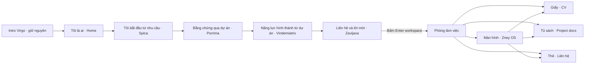
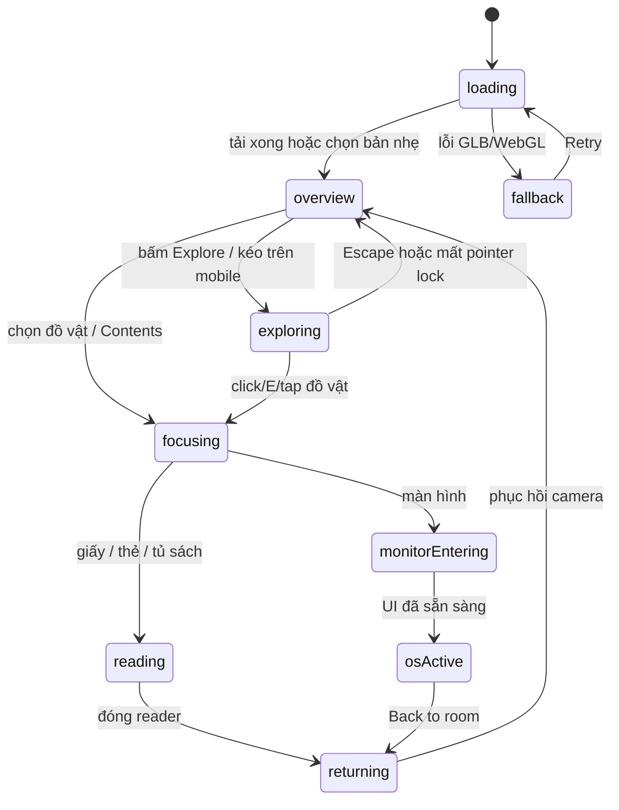

# Kế hoạch trải nghiệm Virgo → Workspace → Zney OS

Ngày: 04/10/2026. Trạng thái: **đặc tả để triển khai, chưa sửa ứng dụng**.

Mục tiêu: người xem hiểu zney là ai, xem được bằng chứng qua dự án, rồi bước vào phòng làm việc để đọc CV, tài liệu và trải nghiệm máy tính. Chuyển động dẫn mắt đến nội dung; nội dung luôn có đường truy cập trực tiếp bằng chuột, bàn phím và cảm ứng.

Tài liệu này chốt các lựa chọn thiết kế, thông số khởi đầu, trạng thái, thứ tự triển khai và điều kiện hoàn thành. Các ngưỡng FPS, tải trang và bộ nhớ bên dưới là **ngân sách đề xuất**, cần đo trên thiết bị thật. Khảo sát hiện tại dựa trên mã nguồn và cấu trúc GLB; chưa có nghiệm thu hình ảnh, cảm biến hay FPS trong trình duyệt.

## 1. Phạm vi và những phần phải giữ nguyên

1. Giữ nguyên intro chòm Virgo: hình dáng, 14 sao, 16 liên kết, cách ánh sáng phân nhánh, thời gian tự dựng 8,4 giây, màu, độ sáng, kích thước và nhạc/âm thanh hiện hữu. Giữ hành vi reduced motion hiện có của intro.
2. Giữ handoff hiện tại: `.94 → 1.10 → 1.24 → 1.60 → 1.82`; chỉ đổi chủ sở hữu cảnh ở `1.24` khi lớp che đã kín. Không đồng thời hiện hai chòm sao, không sửa shader/lớp phủ intro để phục vụ hiệu ứng chữ mới.
3. Giữ đường bay, hướng nhìn, lens và khoảng cách giữa sao: 480 world units; giữ vật thể đi ngang làm mốc chiều sâu. Không thay chuyến bay bằng zoom FOV, video, panorama hoặc chuyển trang phẳng.
4. Chỉ chỉnh camera bố cục tại trạm khi cần nhường chỗ đọc; phải nội suy ở vùng tiếp cận, không giật trong vùng đang đọc. Việc tăng chất lượng bay là hạng mục sau cùng, tùy ngân sách.
5. Giữ căn phòng, bàn gỗ, màn hình, bàn phím, chuột, case RGB, thẻ đeo, giấy và tủ sách. Tối ưu tài nguyên từ mô hình gốc; không thiết kế phòng mới.
6. Giữ 10 dự án, 5 nhóm năng lực, hai CV và các đường dẫn đang được chia sẻ. Không tự tạo số liệu thành tích, kinh nghiệm việc làm hoặc link repo còn thiếu.
7. Chỉ nút “Enter workspace” mới đưa vào phòng. Cuộn hết Contact không được tự vào phòng.
8. Website tiếp tục tiếng Anh theo `App.tsx`; kế hoạch viết bằng tiếng Việt. Dữ liệu `vie/eng` vẫn được duy trì, không thêm công tắc ngôn ngữ vào intro.

**Ranh giới bảo vệ intro:** `VirgoOpening.tsx`, dữ liệu `virgoOpening.ts`, hình học/renderer rift, clip fracture và `FLIGHT_MOTION.openingDuration` được coi là baseline. Chữ giới thiệu là lớp nội dung độc lập, được cải tiến nhưng không tác động hình học, ánh sáng, nhịp và âm thanh intro. Ba câu đầu giữ nguyên nội dung và thứ tự. CSS mới phải có scope, không đổi global ảnh hưởng intro.

## 2. Hiện trạng đã xác minh

| Khu vực | Mã hiện tại / dữ kiện | Hệ quả cho kế hoạch |
|---|---|---|
| Luồng chính | `App.tsx` dùng `VirgoPortfolio`, 7 chapter: cosmos, home, story, projects, projects-more, skills, contact | Làm trên luồng đang chạy; không sửa nhầm `ScrollPortfolio`/`StarJourney` cũ |
| Nhịp kể | `virgoNarrative.ts`, `virgoPacing.ts`: một tọa độ chung cho chữ và camera; wheel đi theo câu | Giữ cơ chế lấy mẫu thuận/nghịch; không gắn thêm timer tự chạy chữ |
| Đoạn bay | `virgoTransit.ts`: 1.82–1.92; 2.32–2.94; 4.25–4.80; 5.30–5.82 | Giữ các vùng bay không có đoạn văn hoặc nút đọc |
| Chữ | CSS nhiều mức 7–11 px, nhiều rule ghi đè; chữ/controls đặt ở nhiều vùng khác nhau | Tăng cỡ đọc, gom một hệ bố cục, giảm việc mắt phải đuổi chữ |
| Thiên thể | Quỹ đạo dùng `(r cosθ, .55r sinθ, .34r sinθ)`; tốc độ phụ thuộc index; ring/vệ tinh chưa có phân loại nội dung độc lập | Chốt một mô hình quan hệ và một phép tính quỹ đạo dùng chung |
| Workspace | `POVControls` kéo chuột, chưa có pointer lock/cảm biến; `App.tsx` chặn mobile dọc | Bổ sung điều khiển theo trạng thái; bỏ màn chặn dọc khi triển khai |
| Chọn đồ vật | Phân loại theo tên mesh, 4 loại paper/lanyard/bookshelf/screen | Giữ semantic ID nhưng thay dò chuỗi rải rác bằng registry và hit proxy |
| CV trong phòng | `ModalCV` render Markdown bằng `<pre>`, có link ra `#/cv/...` | Dùng reader chung, định dạng thật, không tự thoát phòng |
| Tủ sách | `ProjectShelf` là danh sách link `#/project/:id` | Cần thư viện tài liệu và reader tại chỗ; route con nằm trong workspace |
| Zney OS | `DesktopOverlay` hiện chủ yếu là radar mini-game, keyboard và LED | Thêm Home/Projects/Documents/Contact; đưa game thành ứng dụng phụ |
| Tài nguyên | `main.glb`: 84.360.672 bytes ≈ 84,36 MB / 80,45 MiB; 1.556 nodes, 697 meshes, 93 materials | Số mesh trong file không bằng draw calls; phải đo renderer sau load |
| Ảnh nhúng | 62 images, tổng bufferView ảnh 74.103.540 bytes ≈ 87,8% dung lượng GLB | Ưu tiên giảm ảnh/texture, sau đó mới tối ưu hình học |
| Màn hình GIF | `screenDesktop.gif`: 2.347.025 bytes; mã giải mã nhiều frame canvas | Không giải mã GIF này trong đường tải tối thiểu; dùng poster và preview nhẹ |

`docs/portfolio-content-sources.md` có một số mô tả navigation cũ khác luồng hiện hành. Dùng mã đang chạy để xác định routes; dùng tài liệu này để truy xuất nguồn nội dung. Không coi phần mô tả navigation cũ là yêu cầu mới.

Các file untracked đang có trước kế hoạch: ba WAV crack/debris/rumble, các script fix/generate-scene và `tmp_original.tsx`. Không xóa, ghi đè hoặc mặc định coi đó là asset đã được duyệt.

## 3. Câu chuyện và phân bổ nội dung

### 3.1. Định nghĩa “trang 2 → 3”

Theo chapter hiện hành: trang 1 = cosmos/intro, trang 2 = home/lời mở, trang 3 = story/Spica. Kế hoạch xử lý cả home → Spica và Spica → Porrima để mạch giới thiệu đến dự án không bị đứt.



### 3.2. Kịch bản câu chữ chốt cho bản triển khai

Giữ 10 beat và các khoảng `from/to` hiện có. Dấu câu, ngắt dòng bằng CSS; không tạo `<br>` cố định theo màn hình. Mỗi beat chỉ có một câu chủ đạo; không hiện hai câu chủ đạo cùng lúc.

| Beat / khoảng p | Câu tiếng Anh trên UI | Ý nghĩa / nội dung phụ | Điểm nhìn và liên kết |
|---|---|---|---|
| 0 / .68–1.12 | I'm zney. | Giữ câu hiện tại | Chính giữa; chòm sao vẫn giữ nguyên |
| 1 / 1.12–1.40 | I learn by building. | Giữ câu hiện tại | Vùng trên trái như hiện tại |
| 2 / 1.40–1.82 | I turn ideas into useful tools. | Giữ câu hiện tại | Vùng dưới phải, cùng bố cục handoff |
| 3 / 1.92–2.32 | I start with what people need. | UEH · Information Technology; Web & systems; Expected Aug 2027 | Spica bên trái; nội dung bên phải. Caption phụ: “Every project starts with a practical problem.” |
| 4 / 2.94–3.52 | Here is how I turn those needs into projects. | 3 dự án đại diện: BeatSync, SentinelLAN, Study Cabin | Porrima bên phải; danh sách bên trái, cùng màu/ID với hành tinh |
| 5 / 3.65–4.25 | Each project gives me something new to learn. | 7 dự án còn lại, phân trang theo không gian có sẵn | Giữ nguyên hệ Porrima; chuyển tập lựa chọn, không dựng một hệ sao mới |
| 6 / 4.80–5.04 | Those projects shape the way I build. | Chọn 1 trong 5 nhóm năng lực | Vindemiatrix trái; năng lực phải |
| 7 / 5.04–5.30 | Interfaces, apps and systems—connected with care. | 2–3 dự án chứng minh nhóm đang chọn; link đọc chi tiết | Giữ card năng lực tại cùng tọa độ, chỉ thay tiêu đề/câu phụ |
| 8 / 5.82–5.94 | Have an idea? | Chưa bung toàn bộ link | Zavijava trái; câu hỏi phải |
| 9 / 5.94–6.20 | Let's talk—or explore my workspace. | Email, GitHub, LinkedIn, CV, Enter workspace | Portal quanh sao gợi lối vào; vẫn phải bấm nút DOM |

Bản Việt tương ứng các câu sửa: “Đây là cách mình biến nhu cầu thành dự án.”; “Mỗi dự án cho mình thêm điều để học.”; “Những dự án ấy định hình cách mình xây dựng.”; “Giao diện, ứng dụng và hệ thống được kết nối cẩn thận.”; “Cùng trao đổi, hoặc ghé không gian làm việc của mình.” Các câu không sửa giữ bản Việt trong dữ liệu hiện có.

Với `p` thực tế chỉ đến 6, beat cuối phải có trạng thái settled tại `p=6`: opacity 1, toàn bộ CTA tương tác được; không yêu cầu đi đến 6.20 mới mở đủ nội dung. Giữ khoảng cuối hiện tại nhưng kiểm tra biên này rõ ràng.

### 3.3. Quy tắc phân tầng thông tin

| Tầng | Nội dung | Giới hạn |
|---|---|---|
| Nhìn lướt | Một câu chủ đạo, tên hệ sao | Câu ≤ 14 từ; tối đa 3 dòng mobile |
| Tìm hiểu | 3 dự án hoặc một nhóm năng lực + bằng chứng | Mỗi item: tên, một mô tả ≤ 90 ký tự, category/year phụ |
| Đọc sâu | Case study, README đã biên tập, CV | Reader có mục lục, cuộn riêng, chọn/copy chữ |
| Hành động | Xem source/demo, tải CV, liên hệ | Tối đa 2 CTA chính trong một header; link khác ở vùng phụ |

Không rút gọn nội dung tài liệu để nhét vừa cảnh 3D. Cảnh 3D dùng để khám phá; reader dùng để đọc đầy đủ.

## 4. Hệ bố cục và kích thước

### 4.1. Quy ước

- `W/H` = kích thước CSS pixel của visual viewport; canvas dùng device pixel theo quality tier. Dùng `100dvh` và safe-area insets; không dùng chiều cao cố định 100vh cho mobile.
- Desktop rộng: W ≥ 1100 và pointer fine. Compact/tablet: 768 ≤ W < 1100. Mobile dọc: W < 768 và H ≥ W. Màn ngang thấp: H < 600; áp dụng cả khi W > 768, tránh nhận nhầm là desktop đầy đủ.
- Input capability (`pointer: coarse`, `hover`, API sẵn có) quyết định điều khiển; breakpoint chỉ quyết định bố cục. Laptop cảm ứng không bị ép thành giao diện điện thoại.
- Vùng an toàn: desktop `g = clamp(24px, 5vw, 80px)`; tablet 24 px; mobile 16 px; màn rất hẹp 320 px dùng 12 px. Cộng safe-area tương ứng.
- Grid 8 px; khoảng cách nhỏ 4/8/12 px; nội dung 16/24/32 px; giữa các vùng lớn 48 px. Hit area tối thiểu 44×44 px, nút chính 48 px cao, khoảng giữa hit areas ≥ 8 px.

### 4.2. Bố cục tại trạm, tính trên viewport an toàn

| Thành phần | Desktop 1440×900 | Mobile dọc 390×844 | Mobile ngang 844×390 |
|---|---|---|---|
| Tâm sao Spica/Skills/Contact | x=.29W, y=.46H | x=.50W, y=.26H | x=.24W, y=.50H |
| Tâm sao Porrima | x=.71W, y=.46H | x=.50W, y=.26H | x=.24W, y=.50H |
| Vùng thiên thể chính | rộng .44W, cao .68H | y=80…330 px tại H=844 | trái 44% W, dưới header |
| Content phải | x=.56W, w=min(.36W,520), y=.22H | x=16, w=W−32, y theo công thức bên dưới | x=.48W, w=.49W−safeRight, y=56 |
| Content trái Porrima | x=.08W, w=min(.36W,520), y=.22H | Cùng content mobile, không đảo trái/phải | Cùng content phải màn ngang |
| Khoảng title → body | 24 px | 16 px | 12 px |
| Khu controls/danh sách | Bắt đầu ngay sau câu + 24 px, tối đa đến H−80 | Sau câu + 20 px, không vượt H−safeBottom−68 | Cuộn nội bộ đến H−safeBottom−12 |
| Nav chòm sao | Góc phải trên, vùng hình ≤144×100; hit area riêng 44 px | Nút “Chapters” 44×44 mở menu chữ; không ép 4 hit area vào hình nhỏ | Cùng menu chữ 44×44 |
| Nhắc thao tác | Cạnh dưới, baseline H−32 | H−safeBottom−28, 12 px; ẩn khi reader mở | Chỉ icon help 44 px |

Các tọa độ tâm sao là **đích bố cục ở trạm**, không thay world positions của tuyến bay. Dùng projection/view offset hiện có và nội suy từ cuối đoạn bay; kiểm tra sao vẫn tròn, không stretch canvas. Tablet dùng hai cột 46/46% với gutter 24 nếu đủ chỗ; nếu cột chữ < 320 px thì chuyển layout dọc.

Mobile dọc: `contentTop = max(.44H, projectedHaloBottom + 24px)`; đo halo và DOM thực, không dựa vào tâm sao đơn thuần. Đặt `available = H − safeBottom − 68 − contentTop`. Nếu nội dung không vừa, thực hiện đúng thứ tự: giảm khoảng cách xuống 12 px → chuyển facts thành hàng tóm tắt → danh sách 2 item/trang → vùng đọc riêng có cuộn. Nếu `available < 220px`, chuyển “compact reading layout”: thiên thể thành vùng trên cao 120 px, nội dung dưới; không thu font nhỏ hơn mức tối thiểu. Chi tiết camera vùng trên được fit theo bounds, không crop nội dung đọc.

### 4.3. Typography và màu

| Token | Desktop | Mobile / ngang thấp |
|---|---|---|
| Câu chủ đạo | clamp(32px, 2.8vw, 44px), line-height 1.18, max 22ch | clamp(24px, 6.2vw, 30px), line-height 1.22; ngang thấp 24 px |
| Tên dự án/header reader | 18/28 px | 17/24 px |
| Body/doc | 16 px, line-height 1.65, max 68ch | 16 px, line-height 1.65; không giảm khi ngang |
| Metadata | 13 px, line-height 1.5 | 12 px, line-height 1.5 |
| Kicker | 12 px, letter-spacing .10em | 12 px, letter-spacing .08em |
| CTA | 14 px, weight 600, cao 48 px | 15 px, cao 48 px |

Giữ roman serif của câu kể; UI và body dùng font sans đang có; monospace chỉ cho mã ngắn. Nền `#050913`, chữ chính `#F3F5FA`, chữ phụ `#B5C1D2`, surface `#101A2A`, border `#33435C`. Giữ `project.color` cho accent, không dùng nó trực tiếp làm body text trên nền tối. Đo contrast: chữ thường ≥4.5:1, focus/controls ≥3:1. Vùng đọc trên sao có gradient scrim tĩnh `rgba(5,9,19,.72)` tối đa; không blur toàn viewport mỗi frame.

Không dùng chữ glow mạnh, xoay chữ, typewriter hoặc scramble cho thông tin chính. Chữ đã ổn định phải rõ như trang tài liệu bình thường.

## 5. Đặc tả animation đồng bộ

### 5.1. Một nguồn tiến độ và hai loại thời gian

- `p`: tọa độ chuyến bay đã được pace; mọi chữ, controls, opacity hệ sao và chuyển tiếp trạm đều lấy mẫu từ `p`.
- `ambientTime`: chỉ dùng cho tự quay hành tinh, quỹ đạo chậm và nền; dừng khi hidden, mở reader hoặc reduced motion. Cùng `p` và cùng `ambientTime` phải cho cùng geometry; không tuyên bố quỹ đạo ambient đảo ngược chỉ vì scroll đảo ngược.
- Pointer/gyro không sửa `p`. Workspace dùng clock riêng, hủy khi rời workspace. Không để GSAP và R3F cùng ghi một camera hoặc cùng một DOM property.
- Timer chỉ dùng cho tương tác độc lập như debounce/hover; không dùng `setTimeout` để xếp chữ trong chuyến bay.
- Nội dung ở midpoint đứng nguyên cho đến thao tác tiếp. Các “readSeconds” hiện tại chỉ là tốc độ tối đa khi di chuyển qua vùng đọc, không phải đồng hồ tự đóng nội dung.

### 5.2. Tokens đề xuất

| Token | Giá trị | Dùng cho |
|---|---|---|
| feedback | 100 ms | Hover/focus, reticle đổi trạng thái |
| fast | 180 ms | Đổi tab, tooltip, đóng phần phụ |
| panelEnter | 320 ms | Reader/modal/sheet vào |
| panelExit | 220 ms | Reader/modal/sheet ra |
| storyOpen | 500 ms | Câu tại trạm mở, bám pace hiện tại |
| storyClose | 360 ms | Câu tại trạm đóng |
| homeOpen/homeClose | 400/280 ms | Giữ nhịp ba câu đầu |
| stagger | 60 ms | Tối đa 3 item ban đầu; nhiều hơn thì phần còn lại hiện cùng nhóm |
| focusCamera | 650 ms | Hướng tới đồ vật; không áp cho bay giữa sao |
| monitorEnter / return | 900 / 600 ms | Vào màn hình / về góc nhìn cũ |
| easeOut | cubic-bezier(.22,1,.36,1) | UI xuất hiện |
| easeInOut | cubic-bezier(.4,0,.2,1) | Camera workspace, đổi surface |
| distance | 8 px desktop, 6 px mobile | Card/sheet dịch nhẹ; **câu kể không dịch lên** |

Các duration story là giá trị pace tối thiểu khi có input liên tục; không cộng thêm một CSS transition làm chữ tụt sau `p`. Tạo `motionTokens.ts`; shader, GSAP, CSS custom properties dùng cùng token. Giữ GSAP/CSS/Three hiện có; không thêm Motion/Framer chỉ để thực hiện bảng này.

### 5.3. Hợp đồng vào – đọc – ra của một beat

Từ `narrativeEdges(index)` lấy `open/close`. Đặt `enterT = clamp((p−from)/(open−from))`, `exitT = clamp((p−close)/(to−close))`; easing smoothstep. Bảo đảm `open < midpoint < close`, kể cả beat Contact ngắn.

| Lớp | Vào | Đọc | Ra |
|---|---|---|---|
| Accent quanh câu | 0–25% enter: mở viền mỏng, opacity 0→.35 | Thu về opacity ≤.08 | Thu viền cùng exit, không chạy một vụ nổ mới |
| Câu kể | 20–85% enter: opacity 0→1, đứng y cố định | Opacity 1, không rung/blur | 0–80% exit: opacity 1→0 |
| Facts/danh sách | 50–100% enter, stagger 60 ms quy đổi về enterT | Giữ vị trí, tương tác đầy đủ | 0–55% exit: opacity 1→0, translateY 0→−8 px (mobile −6) |
| Labels hệ sao | 70–100% enter | Tối đa 1 label chọn và 2 label liên quan | 0–40% exit |
| Scrim | Theo opacity nội dung, không trễ | Ổn định | Hết tại exitT=1 |

Controls chỉ nhận tương tác khi `enterT≥.85 && exitT===0` hoặc beat đã settled; trước đó `inert` và không nằm trong tab order. Không ẩn bằng opacity mà để link vẫn click được. Khi keyboard focus đang trong content, giữ beat tại reading anchor; chỉ rời khi người dùng chọn chapter/Next hoặc focus rời vùng. Screen reader có câu active trong DOM; lớp hiệu ứng và bản chữ trang trí `aria-hidden`, không đọc hai lần.

### 5.4. Ngôn ngữ hiệu ứng theo chương

| Khu vực | Hiệu ứng chủ đạo | Giới hạn |
|---|---|---|
| Ba câu Home | Giữ nebula/rift/aurora hiện có, chữ fade rõ hơn | Không sửa intro canvas/clip; không tăng độ sáng |
| Spica | Một cung quỹ đạo mảnh nối hướng từ sao đến vùng chữ | 1 đường, stroke 1 px CSS, alpha ≤.28; cách ink ≥16 px |
| Porrima | Một đường tín hiệu từ hành tinh được chọn sang item | 1 đường chính; dust chỉ lúc vào, desktop ≤24 hạt, mobile ≤8 |
| Projects-more | Đổi selection và danh sách tại cùng vị trí | Không reset hệ sao hoặc phủ rift toàn màn hình |
| Skills | Tín hiệu từ năng lực đến bằng chứng | Tối đa 3 tia, chạy một lượt 600 ms lúc đổi selection |
| Contact | Portal 3 vòng sẵn có + accent nhẹ ở CTA | Vòng là trang trí; không bắt nhắm trúng portal để liên hệ |

Hiệu ứng phụ phải nằm ngoài ink rectangle đo bằng DOM Range; không đi qua chữ, không phủ CTA. Nếu chưa đo được font/layout, tạm không vẽ accent, vẫn hiện chữ. Sau fonts ready/resize đo lại, không đo full DOM mỗi frame.

### 5.5. Hai đoạn chuyển tiếp quan trọng

**Home → Spica:** giữ toàn bộ fracture/handoff p=.94…1.82. Câu “I turn ideas into useful tools.” đóng xong ở 1.82; 1.82…1.92 chỉ có chuyến bay 300 units, giữ approach pace ≥1,9 s. Spica hiện từ dữ liệu presence hiện tại; tại 1.92 câu nhu cầu xuất hiện, sau đó facts. Không có một màn loading thứ hai hay fade-to-black mới.

**Spica → Porrima:** p=2.32…2.94, giữ pace ≥3,4 s và đường bay. Caption cuối Spica đã kết thúc trước departure. 0–18% leg: hệ Spica ra khỏi trọng tâm; 18–82%: hành tinh/đá đi ngang như hiện tại; 82–100%: Porrima vào đúng khung. Các tỷ lệ là vùng kiểm tra composition, không ghi đè hàm `systemPresence`. Sau 2.94 mở câu dự án rồi ba item. Dấu nhấn màu của UI chuyển xanh Spica sang vàng Porrima trong phần cuối, không flash trắng.

Khi cuộn ngược, sample lại cùng timeline; không phát lại enter từ đầu. Fast jump/deep link phải lấy mẫu đích ngay; không phát hàng loạt SFX cho những vùng bị bỏ qua. Browser Back về đúng beat và vị trí đọc trước đó.

## 6. Logic hành tinh, vệ tinh và vành đai

### 6.1. Ngữ nghĩa thống nhất

- Sao trung tâm = một chương. Tên Spica/Porrima/Vindemiatrix/Zavijava là nhận diện mỹ thuật, không mô phỏng hệ thiên văn thật.
- Hành tinh Porrima = một dự án, map bằng `project.id`; không map bằng thứ tự mảng vì filter/reorder có thể đổi thứ tự.
- Hành tinh Skills = một capability; chọn nó chỉ hiện những dự án trong `capabilities[].projects`.
- Vệ tinh = chương tài liệu/bằng chứng thuộc hành tinh mẹ, không là dự án mới. Chỉ gắn vệ tinh có doc tương ứng; những vệ tinh trang trí cũ không có doc thì không click và không hiển thị label giả.
- Vành hành tinh = hình thái vật thể; vành quỹ đạo quanh sao = đường chuyển động; vành tiểu hành tinh = môi trường. Cả ba không mang trạng thái “đã làm được” hay mức thành thạo.
- Đá/comet/probe không click. Portal Contact mở cùng CTA DOM, không giữ nội dung độc quyền.

### 6.2. Registry và phân nhóm chốt

Giữ màu trong `portfolio.ts`; texture family là nhận diện bổ sung. Ba vòng dự án có bán kính desktop 24/40/64 units; belt 50…54. Đây là điều chỉnh hệ cục bộ, không thay 480-unit tuyến bay. Slot theo thứ tự bảng; `phase0 = −π/2 + ringIndex*.3 + slot*2π/slotCount`, giữ khoảng góc đều trên từng vòng.

| Project ID | Vòng / slot | Surface | Chi tiết phụ | Mặc định trong UI |
|---|---|---|---|---|
| beatsync | 24 / 0 trên 3 | ocean | 1 vệ tinh Architecture | Featured |
| sentinellan | 24 / 1 trên 3 | cratered | 1 vệ tinh Architecture | Featured |
| study-cabin | 24 / 2 trên 3 | ice | Không vành, không vệ tinh thêm | Featured |
| backup-data | 40 / 0 trên 4 | cratered | 1 vệ tinh Decisions | More |
| cloud-pos | 40 / 1 trên 4 | gas | Vành nhỏ; không vệ tinh | More |
| security-core | 40 / 2 trên 4 | red rock | 1 vệ tinh Architecture | More |
| mandy-crimson | 40 / 3 trên 4 | ocean | Không thêm vật phụ | More |
| luckyfood | 64 / 0 trên 3 | ocean | 1 vệ tinh Decisions | More |
| chemistry-lab | 64 / 1 trên 3 | lava | Không thêm vật phụ | More |
| micro4nerds | 64 / 2 trên 3 | ice | Vành nhỏ; không vệ tinh | More |

Tên surface trong bảng là ý đồ thiết kế; adapter phải map sang union `PlanetType` thực tế, không tự truyền chuỗi chưa tồn tại vào renderer. Dữ liệu doc chưa biên tập xong thì vệ tinh tương ứng tạm là decoration, không tạo link hỏng.

Body radius mặc định theo ID, world units trước mobile scale: beatsync=1.60, sentinellan=1.90, study-cabin=1.45, backup-data=1.35, cloud-pos=2.10, security-core=1.70, mandy-crimson=1.20, luckyfood=1.55, chemistry-lab=1.80, micro4nerds=1.65. Skills: interfaces=1.40, systems=1.70, mobile=1.50, simulation=1.60, delivery=1.80; không thêm moon/ring cho Skills ở v1. Spica giữ body families hiện tại, giới hạn radius≤2.2 và phụ kiện theo cùng envelope.

Spica giữ 4 hành tinh tượng trưng 4 bước: Need → Build → Connect → Learn. Không gắn stack hay năng lực giả lên chúng. Hover/chạm chỉ highlight một nhãn ngắn và câu mô tả bước, không mở thêm modal. Skills dùng 5 hành tinh, vòng 24 chứa interfaces/systems/mobile, vòng 40 chứa simulation/delivery; mapping evidence giữ nguyên data. Contact giữ portal, không thêm hệ hành tinh dày đặc.

### 6.3. Hình học và vận động

1. Một `OrbitDefinition` dùng chung cho hành tinh, đường guide, hit target, connector và belt: center, radius, plane basis, period, phase. Không sao chép công thức riêng trong JSX và DOM.
2. Chuẩn hóa `u=(1,0,0)`, `v=normalize(0,.55,.34)`. `position=center+r*(cosθ*u+sinθ*v)`. Hai vector trực chuẩn tạo vòng tròn thật trong mặt phẳng nghiêng; ellipse nhìn thấy đến từ phép chiếu. Hiện tại `.55/.34` làm co trục quỹ đạo trong world space; chỉ đổi hình học hệ cục bộ, chụp so sánh trước/sau.
3. `θ=phase0+2π*ambientTime/period`. Vòng 24/40/64 dùng 100/150/220 giây. Các vật trên cùng vòng có cùng vận tốc góc và chiều dương, giữ khoảng cách slot; scroll chỉ điều khiển appearance/selection, không kéo vật khỏi đường quỹ đạo.
4. Body radius giữ trong 1.0…2.2 units, lấy seed cố định theo ID. Không phóng cả hành tinh 1.28× khi hover: dùng halo + outline để không đụng quỹ đạo. Self rotation 45…90 s, không liên quan tốc độ orbit.
5. Vành riêng hành tinh: inner=1.35R, outer=2.10R; tilt 18…26°, gắn với planet transform; không quay quanh sao riêng. Vệ tinh: radius=.18R, local orbit=2.8R, period=18…30 s; không gắn vệ tinh trên vật có ring ở bản này.
6. `extent = max(bodyRadius, ringOuter, moonOrbit+moonRadius)`. Mọi shell cách shell kế tiếp ≥ tổng extent lớn nhất hai shell + 2 units. Belt không cắt envelope vệ tinh/ring. Nếu data vượt giới hạn, CI báo lỗi; ưu tiên giảm phụ kiện, không di chuyển camera tuyến bay.
7. Mobile giữ local group scale `.72`; radii trước scale là `[30,50,78]`, belt `[62,67]`; belt và phụ kiện cùng scale. Không chỉ clamp vòng trong lên 30 rồi giữ vòng giữa 40, vì như vậy khoảng giữa hai shell bị hẹp. Sao trung tâm giữ cách scale hiện có. Kiểm tra riêng `innerPhysicalRadius − maxExtent > starRadius + 2`; kiểm tra clearance theo world units sau scale. Không tự lấy radius desktop dùng cho guide nhưng mobile radius cho planet.
8. Ánh sáng ngày/đêm và khí quyển hướng về **world position** sao mẹ; không dùng local origin của scene toàn cục cho tất cả hệ. Ring/moon giữ depth test; tránh z-fighting bằng geometry spacing, không bật render-on-top.
9. Đường guide opacity đọc .12 desktop/.16 mobile, selected .35; chỉ reveal alpha, không scale guide. Planet reveal alpha từ 0→1, scale tối đa .96→1 nếu không làm lệch hit geometry; belt chỉ fade, không phình từ tâm.
10. Tối đa một hệ nội dung đầy đủ khi đọc. Hệ kế tiếp chỉ xuất hiện theo presence ở vùng bay; không còn label “lơ lửng” của hệ trước.

Clearance test phải cộng cả bán kính fragment ngoài belt (cap .6 units trước scale). Với upper bound body R=2.2 và moon extent=2.98R, desktop vòng ngoài: `64−(54+.6)−6.556=2.844` units trống; mobile: `(78−67−.6−6.556)*.72=2.768` units trống. Cả hai >2 units. Đây là kiểm tra envelope bảo thủ; không giảm khoảng trống bằng cách tăng radius hover.

Projection labels: label chính rộng 180…240 px desktop, mobile đưa tên vào card dưới cảnh. Desktop anchor lệch 16 px khỏi halo, clamp trong viewport; nếu đè content hoặc bị thiên thể che thì ẩn label phụ. Kết quả raycast phải xét occluder phía trước, không chọn hành tinh xuyên sao. Chọn bằng danh sách luôn có sẵn ngay cả khi vật ở mặt sau.

Khi hover/focus/select project: dừng orbit của cả hệ tại pha hiện tại, giữ ≥120 ms trước highlight để tránh chớp do lia nhanh; rời focus resume tại pha đang dừng, không nhảy bù thời gian. Touch tap vào hành tinh hợp lệ mở cùng reader như bấm tên dự án; không bắt double tap.

## 7. Workspace: điều khiển, bố trí và chọn đồ vật

### 7.1. Trải nghiệm mặc định

Người dùng vào phòng, thấy góc bàn quen thuộc và bốn lối đọc. Desktop có nút **“Explore room”** để vào chế độ ngắm; lúc đó con trỏ hệ thống biến mất và di chuột xoay đầu như FPS. Điện thoại kéo để nhìn và chạm để đọc ngay; nút **“Enable tilt”** bật chuyển động theo tư thế máy. Luôn có menu **“Contents”** để mở CV/dự án/liên hệ/màn hình mà không phải tìm đồ vật.

Giữ ngồi tại bàn, không thêm WASD đi xuyên căn phòng. WASD dành riêng mini-game khi game được focus. Yaw desktop được xoay 360°; pitch giới hạn −60°…+55°, roll=0. Những vị trí không có nội dung vẫn là không gian phòng, không thêm hotspot giả để lấp chỗ trống.

### 7.2. Trạng thái bắt buộc



`hidden` là cờ tạm dừng trên mọi state, không xóa state. `inputMode` độc lập: `pointerLocked | drag | touch | gyro | keyboard`. Chỉ một mode ghi camera cùng lúc. Trong focusing/reading/monitorEntering/osActive/returning: input camera bị khóa, raycast chọn bị tắt, không còn listener kéo phòng tranh sự kiện reader.

Chọn item phải lưu `returnPose` (position/quaternion/FOV), `origin`, `selectedId`, scroll reader và chất lượng. Đóng reader phục hồi pose, trở về overview với con trỏ bình thường. Muốn quay tiếp bấm Explore một lần; không tự pointer-lock sau khi người dùng vừa Escape.

### 7.3. Pointer lock desktop

- Gọi `canvas.requestPointerLock()` trực tiếp từ click nút Explore hoặc click canvas trong overview; không gọi từ effect hoặc sau tải async. Nút Explore chỉ bật khi canvas sẵn sàng. Lắng nghe `pointerlockchange` và `pointerlockerror` làm nguồn trạng thái thực.
- API có thể trả promise hoặc không; bọc lỗi cả đồng bộ và bất đồng bộ. Không bắt buộc `unadjustedMovement`. Nếu bị từ chối/không hỗ trợ, chuyển về drag-look, hiện “Drag to look around”; nội dung vẫn đầy đủ.
- Khi đang lock: lấy `movementX/Y`, sensitivity mặc định `.0018 rad/CSS px`; slider tùy chọn .0008… .0030. `yaw -= dx*sensitivity`, `pitch -= dy*sensitivity`; có tùy chọn invert Y trong Settings.
- Smoothing `a=1−exp(−18*min(dt,.05))`; không phụ thuộc FPS, không thêm camera shake/bob. Yaw không clamp, wrap góc để tránh tích lũy số; pitch clamp. Phục hồi camera từ quaternion, tránh Euler wrap tạo vòng quay dài.
- Chỉ ẩn cursor trên canvas đang lock. Reader/OS/toolbar dùng cursor native; bỏ cơ chế fake cursor trong OS mặc định. Không đặt `body {cursor:none}`.
- Tâm ngắm desktop tại 50%/50%, đường kính 6 px trạng thái rỗng; 12 px khi có target, viền 1.5 px, chuyển 100 ms. Tooltip dưới tâm 28 px, max-width 260 px, 13 px, đọc “Resume · Click / E”.
- Raycast center camera, tối đa 30 lần/s; mesh hover không dựa vào tọa độ con trỏ cũ khi lock. Có target ổn định 120 ms mới phát feedback; target mất thì clear sau 80 ms để giảm nhấp nháy mép.
- Click trái hoặc E chọn target; không cần giữ phím. Ignore key repeat; ignore E trong input/textarea/contenteditable/OS. Keydown khi khóa và nút click gọi cùng `selectItem(id)`.
- Chọn item: đánh dấu input consumed → exitPointerLock → chờ unlock event → focus camera/mở reader. Không để click dùng thoát lock đồng thời nhấn nút dưới reader.
- Escape do trình duyệt thả chuột là nguồn sự thật; không chặn Escape. Tab khi lock: thả lock, đưa focus vào Contents; blur/hidden cũng thả lock, clear pressed keys. Không tự chiếm chuột khi tab quay lại.

Pointer lock cần thao tác chủ động và có cơ chế thoát của trình duyệt; đây là điều kiện API, không phải một bước xác nhận triển khai. Tham khảo [MDN Pointer Lock API](https://developer.mozilla.org/en-US/docs/Web/API/Pointer_Lock_API) và [requestPointerLock](https://developer.mozilla.org/en-US/docs/Web/API/Element/requestPointerLock).

### 7.4. Hotspot và camera focus

| ID nội bộ hiện tại | Tên hiển thị | Nội dung mở | Điểm anchor từ model |
|---|---|---|---|
| paper | Resume | Document reader, Web/Mobile tabs | `StackOfPaper`/`Paper` đã resolve chính xác trong manifest |
| lanyard | Contact | Contact card | Node `id_key_lanyard_x-lab.glb` hoặc group đã validate |
| bookshelf | Project library | Library và doc reader | `bookshelf_cc0.glb` / `Bookshelf_0` |
| screen | Zney OS | Monitor transition → OS | `MY_SCREEN`, dùng mặt hiển thị, không toàn bộ chân màn hình |

Giữ camera overview gốc `[5,10,.5]`, target `[1.5,9.5,0]`, FOV 50° cho baseline desktop. Không dùng các tọa độ fallback viết tay làm tọa độ cuối cùng. Tạo `workspaceManifest.ts` sau khi đọc transforms/world bounds; xác minh từng anchor qua debug overlay tạm, không ship overlay.

Hit proxies dùng box/sphere đơn giản gắn theo world matrix của nhóm đối tượng; registry whitelist chỉ có bốn target. Kích thước proxy bằng visual bounds mở rộng 8%; đích touch phải tương đương ít nhất 44 px nhưng không được xuyên occluder hoặc chiếm vùng của đồ vật khác. Nếu proxy nhỏ trên màn hình, hiện nút DOM 44 px tại projected anchor. Desktop lock dùng raycast từ reticle; touch/native pointer dùng vị trí pointer tại lúc tap.

Occlusion: lấy hit gần nhất của cả target và các collider che khuất (mặt bàn, case, tủ, tường); đồ vật chỉ hợp lệ nếu không bị vật khác che trước. Canvas decorations, background và halo không vào raycast. Nếu hai hit area DOM đè nhau, ưu tiên vật gần và đặt một nút “Contents”, không xếp hai nút click chồng nhau.

Focus camera giữ vị trí đầu khi vật đã đủ rõ, chỉ slerp nhìn vào anchor. Khi cần tiến nhẹ: khoảng dịch tối đa .35 world units; không đi xuyên bàn. Tính khoảng fit `distance >= boundingRadius/sin(min(verticalFov,horizontalFov)/2)` cộng 15% margin, dùng direction từ view hợp lệ. Nếu không fit được trong giới hạn, giữ camera và mở reader; không zoom cực mạnh để bắt người đọc chữ trên mesh.

Chọn paper/bookshelf/lanyard: halo 100 ms → camera hướng vật 650 ms → reader bắt đầu vào ở 450 ms, hoàn tất 770 ms. Mobile camera chỉ hướng 350 ms, reader vào 240 ms, tổng ≤500 ms bằng overlap. Reduced motion: giữ pose, reader fade 150 ms. Exit reader 220 ms, restore camera 450 ms (overlap từ 100 ms); lock không tự bật lại.

### 7.5. HUD và bố trí phòng

| Thành phần | Desktop | Mobile dọc | Mobile ngang |
|---|---|---|---|
| Back to portfolio | (24,24), cao 44 | (16,safeTop+12), icon 44 | (safeLeft+12,safeTop+8), 44 |
| Contents / Settings | Góc phải trên, 44 mỗi nút | Góc phải trên, 44; gap 8 | Góc phải trên, 44 |
| Explore/drag hint | Giữa dưới, bottom 24, cao 48 | Hint 2 dòng, bottom safeBottom+80 | Hint 1 dòng, bottom safeBottom+12 |
| Tilt/recenter | Settings; không hiện desktop | Dock đáy, hai nút 48, gap 8 | Dock phải, tránh vùng đọc |
| Target name | Dưới tâm ngắm | Label theo hotspot, chỉ 1–2 visible | Label theo hotspot |
| Contents drawer | Rộng 320 px, 4 hàng 64 px | Bottom sheet cao tối đa 65dvh | Panel phải rộng min(360px,48vw) |

HUD chỉ giữ chỉ dẫn hữu ích. Loại “04 NODES”, RA/tọa độ giả và status chạy liên tục nếu không phục vụ chọn nội dung. Tên phong cách observatory có thể ở góc nhỏ 12 px; không chiếm vùng đồ vật. Label xuất hiện lần đầu tối đa 6 giây rồi thu, trở lại khi mở Help; tên đang focus luôn hiện.

## 8. Điện thoại: nghiêng máy, dọc/ngang và chạm

### 8.1. Quy tắc dùng được trước, cảm biến bổ sung sau

1. Bỏ `MobileLandscapeOverlay` và không chặn audio/loader chỉ vì portrait. Phòng phải đọc CV, docs và mở OS ở cả hai hướng.
2. Lần đầu mặc định kéo để nhìn. Hiện nút “Enable tilt” 48 px, mô tả ngắn “Move your phone to look around. You can still drag.” Không bật prompt quyền ngay khi trang load.
3. Trong click Enable tilt: kiểm tra secure context/API; nếu có `DeviceOrientationEvent.requestPermission`, gọi tại user gesture; nếu không có thì thử subscribe. Không xin microphone/camera/vị trí.
4. Trong 1.5 s không có event hợp lệ, dữ liệu toàn null hoặc permission denied: giữ drag mode, hiện một lần “Tilt isn't available here. Drag to explore.” Không lặp prompt, không khóa nút đọc.
5. Công tắc Tilt chỉ lưu mong muốn, không giả định permission còn hiệu lực sau reload. Nút Recenter không xin quyền mới; dùng tư thế hiện tại làm mốc nếu sensor đang chạy.

API cảm biến có yêu cầu secure context và trên một số trình duyệt cần quyền từ thao tác người dùng; phải feature-detect và có fallback. Tham khảo [MDN requestPermission](https://developer.mozilla.org/en-US/docs/Web/API/DeviceOrientationEvent/requestPermission_static) và [Detecting device orientation](https://developer.mozilla.org/en-US/docs/Web/API/Device_orientation_events/Detecting_device_orientation).

### 8.2. Chuyển tư thế máy thành góc nhìn

- Dùng quaternion và adapter cho `screen.orientation.angle` (fallback event orientation tương thích); không map trực tiếp beta→pitch và gamma→yaw ở mọi hướng. Phải bù xoay màn hình 0/90/180/270°.
- Convention khởi đầu với Three.js: đổi alpha/beta/gamma sang radian; `qSensor = quaternion(Euler(beta, alpha, -gamma, 'YXZ')) * qX(-π/2) * qZ(-screenAngle)`, nhân theo thứ tự ghi ở đây. Giá trị null/NaN không tạo sample hợp lệ; không tự thay mọi null bằng 0.
- `qNeutral` = sample hợp lệ đầu tiên sau bật hoặc Recenter; `qRelative = inverse(qNeutral) * qSensor`. Trích Euler YXZ từ relative quaternion để lấy delta yaw/pitch, bỏ roll; `qView = qBase * quaternion(Euler(clampedPitch, clampedYaw, 0, 'YXZ'))`. `qBase` do drag/recenter quản lý. Chỉ controller ghi qView vào camera; sensor và drag không tự ghi camera riêng. Test đúng chiều ở 0/90/180/270°, rồi chỉ điều chỉnh dấu trong adapter nếu cần, không vá dấu rải rác.
- Chế độ giống ảnh 3D: nghiêng máy chỉ thêm yaw ±12°, pitch ±8° quanh góc nhìn do drag tạo; gain .55; dead zone .5°. Có thể thêm dịch camera tối đa ±.025 units desktop-equivalent trên High, mặc định **tắt translation** để tránh xuyên mesh.
- Damping `1−exp(−10*dt)`. Lấy latest sensor sample trong ref; render tối đa theo rAF, không setState mỗi sensor event. Nếu sensor biến động quá 30° giữa hai sample hoặc event gap >500 ms, giữ pose rồi lấy neutral mới; không giật camera.
- Drag thay `baseYaw/basePitch`; gyro chỉ là offset. Trong lúc drag, giữ gyro offset gần 0 qua blend 120 ms; thả drag chốt neutral mới. Không cộng lại absolute angle mỗi frame gây drift.
- Khi portrait↔landscape: lưu pose/world look direction và state hiện tại, đổi aspect/layout, nhận sample angle mới, đặt neutral lại để hình không xoay 90° đột ngột. Không reset về màn hình chính, không mất trang doc, không replay intro.
- Khi reading/OS/hidden: không áp sensor lên camera. Trở lại overview giữ pose cũ, recalibrate sensor; backdrop không lắc phía sau chữ.
- Reduced motion: tắt sensor parallax và mọi chuyển động tự động. Kéo vẫn điều khiển trực tiếp nếu người dùng chọn 3D; cung cấp Contents/static view đầy đủ.

### 8.3. Touch selection

| Hành động | Kết quả |
|---|---|
| Kéo canvas >8 CSS px | Xoay view, hủy tap selection |
| Tap ≤250 ms, dịch ≤8 px | Raycast tại điểm thả; mở target hợp lệ |
| Tap nhãn DOM | Mở target ngay, stop propagation để không kéo camera |
| Nhiều ngón/pointercancel | Hủy chọn và capture; không mở tài liệu khi pinch |
| Chạm vùng trống | Bỏ highlight, không đóng tài liệu đang mở |
| Cuộn trong reader | Chỉ cuộn reader; không bay/chuyển camera phía sau |
| Bấm Back/Close | Về đúng trạng thái trước, không tự replay loader |

Sensitivity drag `.003 rad/px` theo trục màn hình; clamp pitch như desktop; không cần joystick che cảnh. `touch-action:none` chỉ canvas điều khiển; reader giữ pan-y và pinch zoom của trình duyệt, không dùng meta viewport cấm zoom. Orientation lock không cần thiết. Game trong OS mới có D-pad riêng.

## 9. Reader chung: Resume, project docs và Contact

### 9.1. Vỏ đọc thống nhất

| Thuộc tính | Desktop | Mobile dọc/ngang |
|---|---|---|
| Reader outer | width=min(1120px,W−64), height=min(860px,H−64), giữa viewport | Full viewport an toàn, 100dvh |
| Header | 64 px; breadcrumb, title, close 44×44 | 56 px; title 1 dòng ellipsis, close 44×44 |
| Sidebar/TOC | 208 px, gap 24, hiện từ W≥1100 | Nút “Contents” mở sheet; không cột bên |
| Content padding | 32 px, text max 68ch, căn giữa vùng đọc | 16 px, ngang thấp 20 px nếu đủ |
| Footer hành động | 56 px nếu cần, không che body | Tối đa 64 px + safeBottom; có padding đáy bù |
| Backdrop | Đen alpha .55, không blur trên Low/Medium | Đen alpha .65, không blur |

Reader enter: opacity 0→1, translateY 8→0, 320 ms; exit đảo opacity và y trong 220 ms. Mobile sheet lên 12 px tối đa; không bay cả trang từ đáy 100vh. Reduced motion opacity 150 ms. Khi chuyển giữa hai tài liệu trong cùng reader, crossfade body 120 ms; header/shell đứng nguyên, focus về heading mới.

Sử dụng `<dialog>` hoặc một shell đảm bảo focus trap, `aria-modal`, nhãn heading, Escape, restore focus và inert background. Một thời điểm chỉ có **một** dialog root; TOC overlay là phần trong shell, không lồng modal vô hạn. `select-none` của app phải được override `user-select:text` trong reader. Browser Find, copy, link và zoom phải hoạt động.

Escape/back có thứ tự: đóng popover/TOC → về danh sách trong reader nếu đang ở doc con → đóng reader. Với route được push từ phòng, Back trở về route trước; với deep link trực tiếp, Close thay route về `#/workspace` bằng replace, không gọi history.back() ra khỏi website.

### 9.2. Tủ sách có thể đọc tài liệu dự án

Desktop library: sidebar category 184 px; vùng grid 3 cột khi content ≥780 px, 2 cột từ 520 px, 1 cột dưới 520. Card sách min-width 180 px, cover ratio 3:4 nhưng cao không quá 224 px; khoảng 16 px; tên/summary ở dưới không xoay dọc khó đọc. Mobile grid 2 cột tại W≥360, 1 cột dưới 360; card không thấp hơn hit target. Chế độ List luôn có thể chuyển từ nút 44 px.

Một cuốn sách = một `project.id`. Cover gồm tên, năm, category, dải màu `project.color`, motif hành tinh tương ứng. Không tạo ảnh bìa nặng cho mỗi dự án: dùng SVG/CSS nội bộ. Hover nhấc 4 px/180 ms, focus viền 2 px; tap mở Overview ngay. Mở sách dùng card fade/shared-color 180 ms, không page-flip 3D dài.

Toolbar: search cao 44 px; filter All/Web/Systems/Mobile/Creative lấy enum hiện tại, count tự tính; sort Featured/Name/Year, mặc định Featured (3 đầu như hành tinh). Search tìm name/stack/headline, debounce 150 ms. Không có kết quả: “No projects match …” + Clear filters; giữ search và filters khi đọc rồi quay về.

Mỗi sách có mục lục cố định:

1. **Overview:** summary, role, year, problem.
2. **Architecture:** path/stack và sơ đồ các thành phần có bằng chứng.
3. **Decisions:** contributions, decision, constraints/trade-offs.
4. **Notes & links:** takeaway, attribution, source/demo/docs phù hợp.

Overview và Decisions dựng được từ `portfolio.ts`. Architecture chỉ tạo sơ đồ từ dữ liệu đã có; thiếu thông tin thì hiện đoạn mô tả ngắn, không tự vẽ hạ tầng chưa xác minh. README/docs dài đặt snapshot nội bộ `public/docs/projects/<id>/<slug>.md`, ghi nguồn repo/snapshot/lastReviewed. Không fetch raw GitHub mỗi lần mở hoặc iframe toàn GitHub. Các chương tùy chọn thiếu source được ẩn khỏi TOC; 10 sách vẫn luôn đọc được Overview/Decisions.

Đầu tài liệu luôn có tên dự án, vai trò, status và link source nếu có. Dự án adaptation giữ attribution nhìn thấy, dự án team giữ phạm vi đóng góp. Link demo chỉ hiện nếu data có; Chemistry Lab: link viewer tài liệu không gắn nhãn “Play web game”. Micro4Nerds/Cloud POS không bịa repo URL. Code block scroll ngang trong khung riêng; prose/table có xử lý responsive; Markdown raw HTML tắt, protocol link allowlist.

### 9.3. CV trong Documents/Resume

Nguồn thật hiện tại là `public/file/Le_Quang_Khanh_CV_Web_FullStack.md` và `..._Mobile.md`; chưa có thư mục nguồn `document/Resume` cần sửa riêng. **Documents → Resume** là taxonomy UI mới, trỏ vào hai nguồn này. Một nội dung phải hiển thị giống nhau từ giấy trên bàn, Zney OS và route CV công khai.

Kế hoạch cập nhật CV khi triển khai:

| Mục | Quyết định biên tập |
|---|---|
| Identity / education | Giữ tên, email, UEH, expected Aug 2027 và GPA 2.9/4.0 theo nguồn hiện có; không đổi thành đã tốt nghiệp |
| Web headline | Giữ Full-Stack Web Developer Intern; summary 45–65 từ, nhấn UI→API→data→deployment |
| Web selected projects | SentinelLAN, BeatSync, Cloud POS, Study Cabin; mỗi dự án 2–3 bullet, mỗi bullet tối đa 2 dòng A4 |
| Web additional projects | Security Core và Mandy Crimson giữ trong bản đầy đủ; bản resume ngắn gọn dẫn tới portfolio |
| Mobile headline | Giữ Mobile Developer Intern; LuckyFood → Security Core → Micro4Nerds; 3 bullet/dự án |
| Nội dung phải giữ đúng | BeatSync: adaptation/MIT + Go/Rust; SentinelLAN: khóa/cô lập mô phỏng mặc định; LuckyFood: Google Sign-In chưa bật |
| Skills | Nhóm theo vai trò; ưu tiên công nghệ có bằng chứng dự án; không biến toàn bộ keyword thành chuyên môn thành thạo |
| Kết quả | Không thêm số người dùng, % tăng tốc, doanh thu, mức security assurance nếu không có nguồn |
| Ngày cập nhật | Hiển thị ngày biên tập thực tế; đây không phải xác nhận thành tích mới |

Đây là cập nhật cấu trúc và tính nhất quán từ nguồn sẵn có. Những dữ kiện cá nhân mới ngoài repo cần chủ sở hữu cung cấp; không ngăn phần redesign UI và những sửa đã có bằng chứng.

Reader Resume: tabs **Web / Mobile** cao 44 px; không dùng tab gọi tên `.md` trong nội dung chính. Toolbar có **Print / Save PDF**, **Download source** và Close. Dùng renderer `ResumeContent` được tách ra dùng chung; thay `<pre>` trong `ModalCV`. Có loading skeleton tĩnh, error + Retry + source link; đổi tab nhanh hủy fetch cũ bằng AbortController.

Chỉ giữ hai file CV canonical. Với Web, bốn dự án selected có bullet chi tiết; Security Core/Mandy Crimson đặt Additional projects ngắn trong cùng file. Bản case study đầy đủ vẫn ở portfolio/library, không tạo thêm một CV thứ ba lệch nguồn. “Updated” phản ánh ngày biên tập, không tự gia hạn thời gian dự án “Present” nếu chưa có bằng chứng.

Print: nền trắng, chữ đen, A4, margin 14 mm, font 10.5–11 pt, line-height 1.35; ẩn canvas/HUD/modal backdrop/nav. Web mục tiêu ≤2 trang, Mobile ≤2 trang; không ép một trang bằng cỡ chữ nhỏ. Không cắt heading khỏi bullet đầu (`break-after:avoid`), không ngắt một bullet giữa trang nếu còn đủ chỗ. In nội dung reader active duy nhất. Không đặt nút “Download PDF” nếu chưa thực sự có PDF; trình duyệt Save PDF đã đủ ở bản đầu.

### 9.4. Thẻ Contact

Thay stack năm card che nhau bằng một profile card rõ ràng: width 440 px desktop / W−32 mobile; avatar/tên, một dòng vai trò, email, GitHub, LinkedIn và các social hiện có. Mỗi hàng cao 52 px, icon 20 px, label 15 px, external indicator. Giữ dữ liệu liên hệ hiện có, không tự thêm tài khoản.

Nút Copy email feedback “Copied” 1.5 s, `aria-live=polite`; mailto mở email client. Mobile không cần vuốt qua năm card để thấy kênh liên hệ; các kênh đều nằm trong danh sách cuộn. Social opens không reset reader nếu quay lại tab.

## 10. Vào màn hình máy tính và Zney OS

### 10.1. Chuyển từ vật thể sang giao diện

Không mở một desktop xa lạ sau màn “DISPLAY LINK” toàn màn hình. Preview trên mesh và Home của OS dùng cùng palette, wallpaper và bố cục nhận diện. UI thật là DOM để đọc rõ và bấm được; không render văn bản CV vào texture canvas.

Timeline 900 ms desktop, tính từ khi target screen được chọn và đã thả pointer lock:

| Thời gian | Camera/mesh | DOM |
|---|---|---|
| 0–120 ms | Viền screen sáng nhẹ, lưu returnPose | HUD mất dần 120 ms; preload module OS bắt đầu |
| 120–600 ms | Hướng về mặt screen, tiến có giới hạn; easing liên tục | Không có flash; nền phòng còn thấy |
| 500–780 ms | Khi màn hình đủ rõ, giữ pose | Surface OS từ projected quad màn hình chuyển về khung viewport bằng transform; crossfade 280 ms |
| 780–900 ms | Phòng dừng render khi đã bị che kín | OS opacity=1, native cursor, focus heading Home |

Không ép camera chạm màn hình mới mở UI. Nếu projected quad bị crop/không đủ ổn định hoặc Low/mobile: dùng crossfade 300 ms giữa màn hình và OS; giữ tên/màu để liên tục. Mobile tổng 500 ms, reduced motion 150 ms. Không fake boot progress hoặc chờ đủ 900 ms khi reduced motion.

Nếu module OS chưa ready ở cuối zoom: giữ surface preview tĩnh và dòng Loading + Back; nhận input Back ngay; timeout 10 s hiện Retry/Back. Không khóa camera vô hạn, không coi timer kết thúc là tải thành công. Enter trùng click chỉ tạo một transition; rời route hủy transition và kết quả async cũ.

Thoát OS: lưu app/scroll đang đọc; fade 180 ms, hiện phòng, camera về returnPose trong 600 ms tổng; trả overview, nút Explore có focus nếu trước đó pointer lock. Không replay workspace loader/audio. Quay vào OS cùng phiên giữ app đang mở; có Home button rõ ràng.

### 10.2. Kiến trúc nội dung OS

OS là cách truy cập cùng nội dung portfolio, không giả lập một hệ điều hành có filesystem thật.

| App | Nội dung | Hành vi |
|---|---|---|
| Home | Tên/vai trò, 3 lối Projects/Resume/Contact, recent document | Trạng thái đầu tiên, không auto mở game |
| Projects | Cùng library và reader ở tủ sách | Search/filter/state dùng chung ID; đọc tại chỗ |
| Documents | Resume → Web/Mobile; Project docs theo dự án | Không có file hệ thống giả hay terminal vô tác dụng |
| Contact | Cùng Contact card | Copy email/social links |
| Playground | Radar mini-game, keyboard/LED hiện có | Chỉ chạy game/audio/keyboard handler khi app active và game được focus |
| Settings | Sound, volume, quality, motion info, điều khiển/tilt | Lưu preference; OS reduced motion không được ghi đè bằng setting |

Không thêm window dragging/multi-window ở bản này. Desktop có một content window ổn định, tab hoặc sidebar điều hướng; mobile một app toàn màn hình với Back/Home. Điều này giảm overlap, focus lỗi và lượng canvas phải chạy đồng thời.

### 10.3. Bố cục OS

| Thành phần | Desktop ≥1100 | Tablet/desktop compact | Mobile dọc/ngang thấp |
|---|---|---|---|
| Topbar | 56 px, logo trái, Back to room phải | 52 px | 52 px + safeTop, Back to room 44 px |
| Sidebar/dock | 184 px, item 48 px | 64 px icon + tooltip/focus label | Bottom nav Home/Projects/Docs/More, 56 px + safeBottom |
| Main padding | 24 px; max-width 1280 | 16 px | 16 px, cuộn riêng |
| Home cards | 3 cột, gap 16, min-height 148 px | 2 cột | 1 cột, min-height 104 px |
| Reader | Dùng shell nội dung cùng mục 9, bỏ modal backdrop | Một cột nếu cần | Toàn bộ vùng giữa topbar/bottom nav |
| Bàn phím + chuột giả lập | Chỉ trong Playground, cao ≤min(220px,.24H) | Thu gọn mặc định | Ẩn keyboard cơ; game dùng D-pad |

Main area height=`100dvh−topbar−bottomNav−safeInsets` với `min-height:0`; chỉ vùng main cuộn, không vừa cuộn body vừa cuộn window giả. Documents/Projects không bị keyboard deck chiếm nửa màn hình. Không hiện đồng thời custom pointer và cursor native.

Game mobile: D-pad bốn nút 48×48, gap 8; Dash 64×48; không yêu cầu bàn phím ảo. Keydown WASD/Space chỉ preventDefault khi game đang focused; nhập search, cuộn doc, Tab và phím browser không bị game chiếm. Pausing app dừng timer, pressed keys, sound và LED; score giữ trong phiên, không cần backend.

## 11. Âm thanh: có vai trò, có trạng thái

### 11.1. Giữ nguyên và giới hạn

Intro constellation, fracture và loading audio hiện có được giữ ở baseline, không remix trong đợt này. Những âm mới chỉ thuộc hành trình sau intro và workspace. Không tự dùng ba WAV untracked làm âm cuối cùng. Mọi asset mới cần ghi tên, nguồn/license, duration, byte size; chưa có asset thì dùng silence, không cản nội dung.

Một audio coordinator quản lý trạng thái sau intro; không để mỗi modal tạo một AudioContext riêng. Có thể giữ bộ phát intro cũ qua adapter với ranh giới sở hữu rõ: khi rời scene, nguồn âm của scene fade/pause/dispose; không để intro và room cùng phát ngoài crossfade quy định. Context chỉ resume từ thao tác người dùng; promise play bị chặn không được retry mỗi frame.

Workspace Sound mặc định tắt ở phiên đầu; nút Sound On trong Settings/HUD mở menu cho phép bật. Preference explicit mute có hiệu lực với mọi âm sau intro và được giữ trong localStorage. Intro mặc định hiện hữu không bị đổi; nếu cần mở rộng mute toàn site sau này, đó là thay đổi riêng cần kiểm tra baseline intro. Không dùng âm thanh để cung cấp thông tin duy nhất.

### 11.2. Bảng cue sau intro

Gain tính tương đối với master=1, không phải cam kết loudness trên mọi loa. Master mặc định .5 khi người dùng bật sound. Asset chuẩn hóa true peak ≤−3 dBTP; tránh clip khi trộn. Không thêm nhạc nền mới trước khi có track được chọn.

| Cue | Trigger | Duration / fade | Gain trước master | Quy tắc |
|---|---|---|---|---|
| travel-air | Bắt đầu một transit leg sau intro | 1.2 s, in 120 ms/out 200 ms | .12 | Tối đa 1 voice, không loop theo wheel event |
| station-arrive | Vào reading anchor sau transit thực | 160 ms | .07 | Không phát nếu direct link/khởi tạo route |
| target-focus | Target ổn định 120 ms | 45–65 ms | .045 | Cooldown 300 ms; có thể tắt riêng UI sounds |
| object-select | Chọn đồ vật thành công | 90 ms | .12 | 1 lần; click mở bị chặn không phát |
| paper-open | Reader Resume mở | 160 ms | .08 | Không lặp mỗi lần đổi tab |
| book-open / close | Từ library mở doc / đóng về library | 150 / 100 ms | .08 / .05 | Không page-flip theo scroll |
| monitor-enter | OS thực sự ready | 240 ms, fade 80 ms | .10 | Không boot fanfare kéo dài |
| ui-confirm | Copy thành công, đổi settings có ý nghĩa | 60 ms | .06 | Không phát mỗi hover tab |
| keyboard | Keydown trong Playground | Giữ pack hiện có, envelope chống click | .08 | Max 4 voices, key repeat hạn chế; không phát khi gõ search |
| room-tone (tùy chọn sau QA) | Explore active, sound on | Seamless loop 12–20 s, fade 400 ms | .035 | Tắt trên Low/mobile mặc định; đọc doc duck −12 dB |

Pool tối đa 6 voices gồm ambient và UI. Hidden/tab blur: fade 100 ms rồi pause, giải phóng keydown voices; trở lại chỉ resume ambient đã được user bật, không phát lại cue cũ. Mở external link không gây chuỗi âm khi quay về. Sound off: toàn bộ nguồn thuộc coordinator dừng trong ≤100 ms.

Transit cue dùng latch theo leg/direction: chỉ re-arm khi ra khỏi leg ít nhất .08 p và ≥700 ms; đảo giữa leg fade cue hiện tại, không đảo waveform hoặc xếp nhiều tiếng. Reduced motion tắt travel/arrival/ambient; feedback chủ động vẫn được phép nếu user bật. Network/decode failure chuyển silent và ghi debug một lần, không hiện error modal.

## 12. Hiệu năng và chất lượng tài nguyên

### 12.1. Mục tiêu đo được

| Chỉ số | High desktop | Medium / điện thoại khá | Low / điện thoại yếu |
|---|---|---|---|
| FPS mục tiêu ở scene đã warm | 60; p95 frame ≤20 ms | 45–60; p95 ≤28 ms | 30; p95 ≤36 ms |
| DPR tối đa | 1.75 | 1.25 | 1.0 |
| Visible draw calls workspace | ≤180 | ≤110 | ≤70 |
| Visible triangles workspace | ≤350k | ≤180k | ≤90k |
| Texture GPU budget ước tính | ≤192 MiB | ≤96 MiB | ≤48 MiB |
| Shadow | Một shadow map 1024, bake vật tĩnh | Baked/contact shadow tĩnh | Baked/flat contact, không real-time shadow |
| Material texture max | 2048, chi tiết nhỏ 512/1024 | 1024 | 512; screen poster tối đa1024 nếu cần đọc nhận diện |
| Render room khi đọc/OS | Dừng khi bị che, chỉ invalidate khi cần | Tương tự | Tương tự |

Đây là ngưỡng khởi đầu, không lấy `hardwareConcurrency` làm bằng chứng máy yếu. Initial tier dựa vào viewport/DPR/pointer/saveData chỉ để chọn an toàn; đo frame-time scene thật để quyết định. Mobile ưu tiên Medium, saveData ưu tiên Low. Người dùng luôn chọn Auto/Low/Medium/High trong Settings, nhưng UI đọc giữ nguyên ở mọi tier.

Auto-tier: bỏ warm-up 3 s, đo cửa sổ 3 s, loại frame khi hidden hoặc đang decode asset. Nếu p95 vượt ngân sách liên tiếp 2 cửa sổ, hạ một bậc. Chờ tối thiểu 20 s trước thay đổi nữa; chỉ nâng ở overview đứng yên sau 30 s tốt và có headroom ≥25%. Không thay model/texture tier giữa camera focus; quality change queued đến trạng thái an toàn. Tắt adaptive khi user chọn tier explicit.

### 12.2. Tối ưu `main.glb` theo thứ tự

1. Giữ bản gốc làm nguồn; không ghi đè bằng file tối ưu thử nghiệm. Xuất `workspace-low.glb`, `workspace-medium.glb`, `workspace-high.glb` có manifest/hash/version.
2. Lập inventory ảnh: dimensions, format, byte size, trùng lặp, vật thể sử dụng. Giảm ảnh oversized và duplicate trước; 74,10 MB ảnh nhúng là đòn bẩy chính.
3. Tách loading tiers: low là phòng đầy đủ silhouette với bàn/screen/giấy/tủ/thẻ; medium/high nâng texture và mesh. Không download cả ba tier. Nếu mesh reuse được, tải geometry chung + texture tier; chỉ áp dụng khi pipeline thực sự hỗ trợ, không làm nửa hai phương án.
4. Dùng glTF optimization offline, KTX2/Basis texture và **một** phương án geometry compression tương thích loader (Meshopt ưu tiên, Draco chỉ nếu pipeline có lợi rõ). Đưa decoder cần thiết vào public/vendor, không phụ thuộc CDN lúc runtime. Kiểm tra supported GPU formats và fallback asset; quyết định thêm build tooling phải được ghi trong task asset.
5. Merge vật tĩnh cùng material nhưng giữ bốn interactive roots và manifest anchors; không merge mất paper/screen. Bỏ hidden internals không nhìn thấy từ vùng điều khiển cho phép; không xóa mặt sau cần nhìn khi quay 360°.
6. Bake shadow/AO cho phòng tĩnh; hạn chế light runtime. `Environment preset="city"` cần thay bằng env nội bộ đã tối ưu hoặc baked lighting để tải có kiểm soát; giữ visual baseline bằng screenshot.
7. Thay GIF screen bằng poster cục bộ ≤150 KB. High có thể bật preview video/texture ≤720p/15fps khi màn hình nhìn thấy, ≤800 KB mục tiêu; nếu chưa đạt dùng poster. Không decode sẵn toàn bộ GIF thành hàng trăm canvas.
8. Texture/geometry/material dispose đúng chủ sở hữu; shared cache có refcount, không dispose khi reader đóng nhưng room còn dùng. Sensor/listener/RAF/GSAP ticker cleanup trên route unmount.

### 12.3. Ngân sách tải

| Payload | Mục tiêu compressed transfer | Quy tắc tải |
|---|---|---|
| Portfolio đang có | Không tăng critical JS quá 30 KB gzip chỉ vì workspace mới | Tất cả module workspace/OS lazy |
| Poster fallback phòng | ≤150 KB | Có thể preload khi Contact chuẩn bị vào viewport |
| Low workspace + texture | ≤4 MB | Mạng/saveData thấp; nội dung DOM mở được trong khi tải |
| Medium workspace + texture | ≤9 MB | Mobile khá / desktop integrated |
| High workspace + texture | ≤16 MB | User/high device; không tải cùng lúc cả medium+high |
| OS module thêm | ≤120 KB gzip, không gồm lib shared đã tải | Preload khi người dùng vào phòng xong và idle, hoặc chọn screen |
| UI SFX sau intro | Tổng ≤300 KB | Sau sound opt-in; không chặn scene |
| Docs | ≤100 KB văn bản mỗi doc, ảnh lazy | Theo tài liệu đang mở; không tải tất cả README cùng lúc |

Mục tiêu room interactive: ≤5 s trên kết nối 20 Mbps/RTT 80 ms ở Medium, ≤7 s trên 8 Mbps/RTT 150 ms ở Low, cold cache; đo cả decode/upload/first render. Nếu không đạt, dùng poster + Contents ngay và tiếp tục tải, không giả tiến độ. Indicator phản ánh byte thực khi có content-length; không biết tổng thì indeterminate, không random %.

Khi vào Contact chỉ preload module nhẹ/poster nếu không saveData; **không** preload GLB 84 MB khi mở trang. Sau click Enter workspace mới tải model phù hợp. Back to portfolio hủy fetch có thể hủy; late completion không được setState vào scene đã unmount.

### 12.4. Bay giữa sao: tăng chất lượng có kiểm soát

Giữ nguyên route, FOV, heading, tốc độ cảm nhận và vật mốc fixed world-space. Tier chỉ giảm texture resolution, segment count, particles và overdraw; không bớt hành tinh chứa nội dung.

- High: giữ tối đa 6 passing planets/110 peripheral rocks mỗi passage, belt ≤360 instances; nâng texture sắc nét nếu đo còn headroom.
- Medium: 4 planets/48 rocks như mobile hiện tại, belt ≤140; cùng phối cảnh và khoảng cách.
- Low: 3 planets/24 rocks, belt ≤64; giảm atmosphere/cloud layer nhưng giữ silhouette, màu và mọi lựa chọn nội dung.
- Cull hệ không hiện; không update instanced belt matrices khi hidden/paused. Memoize procedural textures theo tier/seed; resize không tạo lại mỗi frame.
- Không thêm bloom full-resolution, DOF, motion blur hoặc camera shake trong đợt này. Nếu cần glow, dùng giải pháp hiện có và giới hạn vùng sáng để giữ chữ rõ.

### 12.5. Fallback không mất nội dung

WebGL init lỗi/context lost: freeze poster, hiện Contents + “3D view unavailable” + Retry. Context restore chỉ tạo lại renderer một lần theo thao tác Retry hoặc sự kiện đã kiểm soát; không loop vô hạn. Selected doc và route giữ nguyên. Mode 2D vẫn có Resume, all projects, contact và OS apps; chỉ room camera/planet motion không có.

Reader đứng một mình không phụ thuộc model success. Loading quá 10 s hiện ngay hành động “Read content while the room loads”. Không buộc tải asset nặng để tải CV.

## 13. Dữ liệu, routing và ranh giới mã

### 13.1. Một nguồn nội dung

`portfolio.ts` giữ facts project/capability. `projectDocuments.ts` chỉ chứa metadata doc và đường dẫn/section; không copy lại summary nhiều nơi. `resumeFiles` giữ source paths; giấy, OS và CV công khai gọi cùng data loader/renderer.

Các contract đề xuất (đây là đặc tả, chưa phải code đã thêm):

```ts
type WorkspaceItemId = 'paper' | 'lanyard' | 'bookshelf' | 'screen';
type QualityTier = 'low' | 'medium' | 'high';
type DocumentSection = 'overview' | 'architecture' | 'decisions' | 'notes';
type WorkspaceState = 'loading' | 'overview' | 'exploring' | 'focusing'
  | 'reading' | 'monitorEntering' | 'osActive' | 'returning' | 'fallback';

interface ProjectDocument {
  id: string; // projectId/section, unique và stable
  projectId: string; // phải tồn tại trong projects
  section: DocumentSection;
  title: { vie: string; eng: string };
  source: { kind: 'portfolio' } | {
    kind: 'local-markdown'; path: string;
    upstreamUrl?: string; snapshot?: string; reviewedAt: string;
  };
}

interface WorkspaceSelection {
  itemId: WorkspaceItemId;
  source: 'ray' | 'touch' | 'keyboard' | 'menu';
  // Return pose và doc state lưu trong controller, không nhét vào label DOM.
}
```

Registry thiên thể bổ sung `projectId/capabilityId`, `orbitId`, `slot`, `surface`, `radius`, `satelliteDocIds`; test referential integrity. Manifest room giữ node path cụ thể, local anchor/normal, proxy bounds và target action. Resolve/validate manifest một lần khi model ready; nếu node thiếu thì báo debug và giữ lối Contents, không crash scene.

### 13.2. Routes đề xuất, tương thích GitHub Pages

| Route | Kết quả | Close/Back mặc định khi mở trực tiếp |
|---|---|---|
| `#/home`, `#/story`, `#/projects`, `#/projects-more`, `#/skills`, `#/contact` | Giữ luồng hiện tại | Không đổi |
| `#/project/:id` | Public case study, reader đầy đủ | Projects |
| `#/cv/web`, `#/cv/mobile` | Public CV reader | Contact |
| `#/workspace` | Room overview | Contact |
| `#/workspace/resume/:track` | Giấy → CV reader | Workspace |
| `#/workspace/library` | Tủ sách → library | Workspace |
| `#/workspace/library/:projectId/:section` | Tài liệu trong phòng | Library |
| `#/workspace/contact` | Contact card | Workspace |
| `#/workspace/os/:app` | OS, app home/projects/documents/contact/playground/settings | Workspace |
| `#/workspace/os/documents/resume/:track` | OS đọc CV | OS Documents |
| `#/workspace/os/projects/:projectId/:section` | OS đọc project doc | OS Projects |

`App.readViewMode` hiện chỉ nhận hash **bằng đúng** `#/workspace`; phải thay bằng parser path segments để nhận các route con, không chỉ sửa href. Tạo parser dùng chung, validate enum/ID; route xấu hiển thị Not found + lối về context, không vô tình mở intro. Tránh `startsWith('#/workspace')` nhận nhầm `#/workspace-foo`.

Workspace links bên trong không dùng public `#/project/...` nếu mục tiêu đọc tại chỗ. External share link có thể dùng public route; “Copy link” trong library copy route workspace đầy đủ. Không đưa pose float vào URL. Lưu return state vào history.state và memory theo session; deep link không có state dùng default pose và skip transition/loading cinematic.

Khi mở từ interaction trong site, push một history entry cho mỗi bước có ý nghĩa; hover, sensor và scroll position không push. Đóng trở lại known origin nếu có; direct entry replace bằng parent route. Browser back/forward không bị callback transition ghi đè URL sau đó. Scroll restoration keyed theo `{context, projectId, section}`; tab CV keyed theo track. OS và tủ sách dùng chung data nhưng có scroll return riêng.

### 13.3. Bản đồ sửa file

| File/khu vực | Thay đổi được giao |
|---|---|
| `src/App.tsx` | Parser workspace subroutes; bỏ portrait blocker; mount fallback; giữ intro entry |
| `src/data/virgoNarrative.ts` | Copy đã chốt, placement policy, active/settled semantics |
| `src/data/virgoPacing.ts` | Giữ timing baseline; adapter reveal chung; không đổi travel minima |
| `src/components/VirgoPortfolio.tsx/.css` | Typography, bố cục, DOM controls, focus, reader origin |
| `src/components/VirgoScene.tsx`, `VirgoPlanet.tsx` | Orbit registry, lighting/labels, mobile projection/tiers |
| `src/data/virgoSpace.ts`, `virgoFlight.ts` | Công thức orbit và cấu hình shell; bảo toàn camera/transit functions |
| `src/components/ModelAnalyzer.tsx` | Tách orchestration khỏi loader/model/POV/modal; giữ model appearance |
| `src/components/ProjectShelf.tsx` | Library → shared reader, filters/search, không exit phòng |
| `src/components/ResumePage.tsx` | Shared renderer/toolbar, origin callback, print đúng context |
| `src/components/DesktopOverlay.tsx` | OS shell/apps; isolate Playground keyboard/audio |
| `src/components/WorkspaceHUD.css` | Responsive HUD/OS tokens; loại cursor-none ngoài lock |
| `src/utils/audioPreloader.ts` | Chỉ adapter lifecycle khi cần; không thay nội dung/timing intro |
| `public/file/*.md` | Biên tập CV theo mục 9.3, giữ facts có nguồn |
| `docs/portfolio-content-sources.md` | Cập nhật nguồn và route thực tế sau triển khai |

Nhóm file mới dự kiến (tên có thể giữ đúng để bàn giao):

```text
src/data/motionTokens.ts
src/data/celestialRegistry.ts
src/data/workspaceManifest.ts
src/data/projectDocuments.ts
src/utils/appRoutes.ts
src/utils/workspaceAudio.ts
src/components/workspace/WorkspaceController.tsx
src/components/workspace/WorkspaceScene.tsx
src/components/workspace/WorkspaceControls.tsx
src/components/workspace/WorkspaceHUD.tsx
src/components/workspace/useDeviceLook.ts
src/components/workspace/useQualityTier.ts
src/components/documents/DocumentReader.tsx
src/components/documents/ProjectDocument.tsx
src/components/os/ZneyOS.tsx
src/components/os/Playground.tsx
public/docs/projects/<projectId>/<section>.md
public/model/workspace-{low,medium,high}.glb
```

Không chuyển toàn bộ repo sang state library mới. Reducer controller và refs đủ cho v1; React state chỉ đổi state/selection/content, không setState theo frame. Scene/control/audio đọc cùng state. Nếu giữ tên file legacy làm adapter thì document rõ, tránh hai triển khai cùng chạy.

## 14. Thứ tự triển khai có thể giao cho model khác

Mỗi task kết thúc bằng artifact/check cụ thể. Làm tuần tự theo dependency; không sửa thẩm mỹ chưa xong khi routing/input còn sai. Không cần tác nhân song song để thực hiện kế hoạch.

| Task | Phụ thuộc | Việc phải làm | Điều kiện hoàn thành |
|---|---|---|---|
| T00 Baseline | Không | Chụp intro/flight/room, ghi asset inventory và status file; chạy build/check có sẵn | Có baseline 1440×900, 390×844, 844×390; lỗi sẵn có được ghi riêng |
| T01 Contracts/routes | T00 | Parser, content IDs, reader origin, workspace reducer | Public route không gãy; tất cả route con workspace không mount intro |
| T02 Copy/layout | T00 | 10 beat, typography, responsive rules, content density | Không chữ <12 px cho metadata có ý nghĩa; không overlap 3 viewport |
| T03 Reveal/handoff | T02 | Pure timeline sample, enter/read/exit, inert/focus | Scrub thuận/nghịch đúng; hai đoạn 2→3 đúng mục 5.5; intro baseline giữ |
| T04 Celestial logic | T01,T03 | Registry, orbit basis, slots, ring/moon envelopes, selection | 10 project IDs/5 capability IDs đúng; không collision/label xuyên sao |
| T05 Shared readers | T01 | Resume/Project/Contact, scroll restoration, modal focus, lỗi tải | Đọc tại phòng, close trở về đúng context; public readers vẫn dùng được |
| T06 Asset tiers | T00 | Texture audit, LOD exports, decoder/local env, poster | Có byte/draw-call report; từng tier giữ bốn anchor; original còn nguyên |
| T07 Desktop controls | T01,T05,T06 | Pointer lock, raycast proxies/occlusion, keyboard/menu, restore pose | E/click/Escape/Tab hoạt động; lock fail vẫn đọc được |
| T08 Mobile controls | T07 | Bỏ portrait gate, touch, gyro, rotate calibration | Dọc/ngang đều đủ nội dung; từ chối sensor không chặn trải nghiệm |
| T09 Library/CV content | T05 | 10 books, doc sections có nguồn, CV biên tập, print | Search/filter đúng; Web/Mobile CV nhất quán ở mọi entry |
| T10 Zney OS | T05,T07,T08,T09 | Screen transition, 6 apps, responsive shell, game isolated | Đọc doc không chạy keyboard game/3D; Back to room đúng pose |
| T11 Audio/quality | T03,T06,T10 | Coordinator, mute, tier adaptation, lifecycle | Không âm chồng/auto replay; budgets có số đo |
| T12 QA/release-ready | T04…T11 | Ma trận bên dưới, sửa regression, docs nguồn | Không lỗi P0/P1; ghi thiết bị/browser và giới hạn chưa test |

Một task không được coi là xong chỉ vì build pass. T06 không được báo “đã tối ưu mobile” nếu vẫn tải GLB gốc 84 MB. T08 cần ít nhất một iPhone/iPad Safari thật và một Android Chrome thật; giả lập kích thước không kiểm chứng cảm biến. Nếu chưa có thiết bị, bàn giao phần đó với trạng thái “chưa nghiệm thu”, không đổi thành “pass”.

### Prompt bàn giao mẫu

> Triển khai từng task T00→T12 trong `docs/experience-motion-workspace-plan.vi.md`. Giữ nguyên intro và camera flight ở mục 1. Không tự giản lược nội dung, bỏ mobile dọc, bỏ pointer-lock fallback hoặc thay căn phòng. Đọc file hiện hành trước khi sửa; thay đổi logic được liệt kê rõ trong task. Mọi con số trong kế hoạch là default phải áp dụng trước; nếu kiểm thử bắt buộc đổi, ghi giá trị cũ/mới và lý do vào implementation notes. Không bịa dữ kiện CV/docs. Sau mỗi task, kiểm tra đúng acceptance của task và ghi bằng chứng. Không đánh dấu kiểm thử thiết bị thật là đạt nếu chỉ dùng viewport emulator. Không sửa/xóa file untracked của chủ sở hữu. Không deploy/push chỉ vì hoàn tất code nếu chưa được yêu cầu.

## 15. Ma trận nghiệm thu

### 15.1. Viewport, input và tình trạng môi trường

| Nhóm | Trường hợp bắt buộc |
|---|---|
| Desktop | 1920×1080; 1440×900; 1366×768; 1280×720; chuột, trackpad, keyboard-only |
| Phone dọc | 320×568; 360×800; 390×844; 430×932 |
| Phone ngang | 844×390; 932×430; xoay dọc↔ngang 10 lần khi đang đọc và khi đang nhìn phòng |
| Tablet | 768×1024; 1024×768; coarse pointer, có/không bàn phím |
| Accessibility | Reduced motion; 200% browser zoom; large text; keyboard focus; đọc bằng screen reader |
| API | Pointer lock success/denied/unsupported; sensor granted/denied/no data/unsupported |
| Network/render | Cold cache; slow network; asset 404; offline sau tải; WebGL init fail/context lost |
| Lifecycle | Hidden/foreground; blur; Back/Forward; deep link reload; vào/ra room/reader/OS 20 lần |

### 15.2. Acceptance theo hành vi

| ID | Kịch bản | Pass khi |
|---|---|---|
| A01 | Intro ở 0/2.1/4.2/8.4 s | 14 sao/16 edges, branch timing, vị trí, glow, sound baseline giữ nguyên; không thêm cursor/HUD room |
| A02 | Home→Spica forward/reverse/fast jump | Cover kín lúc handoff, không hiện hai hệ cùng lúc, không nhảy bố cục, không caption trong approach |
| A03 | Spica→Porrima | Camera path/FOV/heading giữ, vật mốc fixed, câu nhu cầu nối câu dự án, không hai câu active |
| A04 | Dừng ở reading anchor 30 s | Chữ và card không tự đóng; ambient nhẹ; không HUD đè body |
| A05 | Scrub 20 lần và đổi hướng giữa reveal | Opacity đúng sample, không timer replay, không cue chồng |
| A06 | Từng project/skill ID | Đúng tên/màu/content ở planet, list, library, OS; invalid ID có Not found |
| A07 | Orbit sample ít nhất 1.000 phase và geometry envelope | Guide và body chung plane/center; shells/moons/belt không cắt nhau; không đi vào sao |
| A08 | Chọn đồ vật desktop | Pointer lock ẩn cursor; reticle đúng hit; E/click một lần mở đúng; occluded object không chọn xuyên |
| A09 | Escape/Tab/blur từ lock | Cursor trở lại, camera dừng, focus rõ; không tự lock lại |
| A10 | Reader đang mở, wheel/touch/keyboard | Chỉ reader nhận scroll; nền inert; Tab không thoát; Escape và Close đúng context |
| A11 | Phone tap và drag | Tap mở, drag >8 px không mở; pointercancel/multi-touch không tạo click ma |
| A12 | Tilt portrait/landscape | Góc đúng chiều, roll UI=0; pose không giật 90°; Recenter ổn định; permission fail vẫn dùng drag |
| A13 | Tủ sách | Đủ 10 books; filter counts đúng; search empty state; doc chapters/source đúng; Back giữ filter/scroll |
| A14 | CV từ 3 entry | Giấy/OS/public cùng nội dung; tab nhanh không hiện nhầm fetch; copy được; A4 không in cảnh nền |
| A15 | OS | Home mặc định; 6 app hoạt động; docs không bị keyboard deck; game chỉ bắt key khi focus; mobile có D-pad |
| A16 | Đóng OS/reader | Pose và selected item phục hồi; không replay intro/loading; route không mất |
| A17 | Sound on/off + hidden | Mute ≤100 ms, không autoplay loop retry, sound chỉ ở đúng scene, các cue bị bỏ qua không replay |
| A18 | Quality degrade | Hạ tier không reload route/đổi nội dung; text 16 px giữ; đủ bốn hotspot; fps/report có thiết bị |
| A19 | 20 chu kỳ vào/ra | Không listener/context/texture tăng tuyến tính; không double event; GPU memory trở về plateau hợp lý |
| A20 | GLB lỗi hoặc WebGL không có | Có poster/Contents, CV/docs/contact đọc được, Retry/Back không treo |
| A21 | GitHub Pages deep link | Refresh tất cả route hợp lệ dùng hash không 404; direct CV/doc không cần xem intro lại |
| A22 | Contact cuối p=6 | Câu cuối và Enter workspace hiện đầy đủ; scroll không tự vào room |

### 15.3. Kiểm tra tự động và kiểm tra thủ công

Chạy `pnpm run build` và `pnpm run check:portfolio` sau các thay đổi có liên quan. Script hiện tại chứa cả dữ liệu/route legacy; bổ sung kiểm tra **entry VirgoPortfolio đang chạy**, không coi test component cũ là bằng chứng route hiện tại. Chỉ sửa expected value của test khi đặc tả thực sự đổi, không xóa assertion về intro/camera để làm xanh.

Các test logic cần thêm khi triển khai: route parser + reducer transitions; narrative alpha/settled p=6; orbit registry/envelope; ID links; selection drag threshold; mock pointerlock/sensor deny/cleanup; audio latches. Các test này kiểm tra hợp đồng và failure modes, không snapshot lại toàn bộ JSX.

Browser QA: chụp cùng seed/pose/time cho intro/flight/station/room/OS; video 10–20 s của hai handoff; touch/gyro phải kiểm tra thật. Đối với text rectangle: không overlap controls/star halo, không cắt dòng, không overflow ngang trang tại các viewport. Đo contrast bằng tool, không đoán từ mã màu.

Performance capture: 3 lượt cold và 3 lượt warm trên từng thiết bị, lấy median load và p95 frame; 60 s nhìn phòng, 60 s chuyển trạm, 60 s đọc doc, 60 s game. Báo renderer.info draw calls/triangles/textures cùng lúc nhìn; GPU texture memory ước tính từ allocation/compression, không gắn nhãn là số đo GPU chính xác nếu browser không cung cấp.

Reduced motion không sửa appearance của intro normal mode: dùng preference riêng. Nội dung hiện ngay/opacity ≤200 ms, không auto orbit/travel/gyro; các hành động trực tiếp có thể thay view tức thì. Không chớp toàn màn hình, không để backlight/LED nháy nhanh làm nội dung khó đọc.

## 16. Hồ sơ hoàn tất cần có sau triển khai

- Source triển khai và asset manifest có kích thước/license/hash; original model giữ nguyên.
- Screenshot baseline vs final cho intro, hai chuyển tiếp, ba viewport, bốn đồ vật, reader và OS.
- Danh sách task T00–T12 với trạng thái và bằng chứng, không đánh dấu suy đoán.
- Bảng tải/FPS/draw calls/bộ nhớ ước tính theo thiết bị/browser thực.
- Hai CV đã biên tập, print kiểm tra, nguồn nội dung cập nhật; 10 project books hoạt động.
- Danh sách giới hạn còn lại cụ thể (ví dụ một browser không hỗ trợ tilt), kèm đường fallback đã kiểm tra.

**Tiêu chí chốt:** người dùng có thể đi từ intro tới một case study, từ Contact tới CV trong phòng, từ tủ sách tới docs và từ màn hình tới Zney OS bằng desktop, mobile dọc và mobile ngang; mọi bước có cách quay về rõ ràng, chuyển động không che thông tin, chất lượng đồ họa giảm được mà nội dung không mất.
